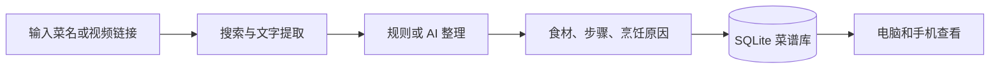

<p align="center">
  
</p>

# 做菜助手

<p align="center">把抖音和 B 站里的做菜视频，整理成一份能照着做的菜谱。</p>

<p align="center">
  <a href="#开始使用">开始使用</a> ·
  <a href="#配置-ai-key">配置 AI Key</a> ·
  <a href="#部署到云端">部署到云端</a> ·
  <a href="#项目结构">项目结构</a> ·
  <a href="CHANGELOG.md">更新记录</a>
</p>

[](https://www.python.org/)
[](https://flask.palletsprojects.com/)
[](https://github.com/77752-create/cook-assistant/actions/workflows/verify.yml)
[](LICENSE)

做菜助手适合想把视频做法留存下来的人。输入菜名，或直接粘贴抖音、B 站链接；应用会提取可用文字，整理出食材、步骤、技巧和每一步的烹饪原因。菜谱保存在你自己的数据库里，也能备份到本地。

## 能做什么

| 你想做的事 | 做菜助手会怎么做 |
| --- | --- |
| 找一道菜 | 搜索抖音和 B 站做法视频 |
| 从视频得到菜谱 | 优先读取字幕、简介和公开文稿，整理成食材与步骤 |
| 看懂火候和顺序 | 给关键步骤补充“为什么这样做” |
| 留住以后还想做的菜 | 保存、查看、复制 Markdown、删除、备份和恢复 |
| 用手机查看 | 同一 Wi-Fi 下访问电脑，或部署到云端 |

## 从视频到菜谱



## 开始使用

以下步骤适用于 Windows。需要先安装 [Python 3.12 或 3.13](https://www.python.org/downloads/windows/)，安装时勾选 “Add Python to PATH”。

1. 新手可从 [GitHub 下载 ZIP](https://github.com/77752-create/cook-assistant/archive/refs/heads/main.zip)，解压后进入 `cook-assistant-main` 文件夹。熟悉 Git 时，也可以运行：

   ```powershell
   git clone https://github.com/77752-create/cook-assistant.git
   cd cook-assistant
   ```

2. 创建自己的配置文件。这个文件只保存在电脑上，不会上传到仓库：

   ```powershell
   Copy-Item config.example.json config.json
   ```

3. 双击 `安装依赖.bat`，等待安装完成。

4. 双击 `启动做菜助手.bat`，浏览器会打开 `http://127.0.0.1:8765`。

5. 在“搜索”页输入菜名，或粘贴视频链接。选择结果后点击“生成模板”，确认内容后再点“保存到菜谱”。

关闭启动窗口，或双击 `停止做菜助手.bat`，可以停止服务。

### 手机访问

让手机和电脑连到同一 Wi-Fi。打开电脑网页的“设置”，把“手机（同一 WiFi）”显示的地址复制到手机浏览器。

手机打不开时，把 Windows 网络设为“专用网络”，并在防火墙提示出现时允许 Python 通过专用网络。电脑关机或服务停止后，手机不能继续访问本地实例。

### 视频文字从哪里来

- **抖音**：只读取公开的 AI 文稿或视频描述。没有公开文字时，应用会给出原视频链接，不会下载抖音视频。
- **B 站**：先读取字幕和简介。两者都没有时，应用会临时下载音频并在本机转写；任务结束后自动删除临时文件。“允许临时下载转写”默认开启，可在“设置”中关闭。
- **首次本地转写**：`faster-whisper` 会下载 `small` 模型。保持网络连接，首次完成前不要关闭程序。若你已下载模型，可在 `config.json` 中将 `whisper_model_dir` 改为模型目录。

视频文字可能漏掉用量、火候或食品安全细节。下厨前请回看原视频，并按食材实际情况调整。

## 配置 AI Key

Key 可以理解成 AI 服务商给你的账户钥匙。它只应放在你的电脑或部署平台中，不能发到 GitHub、聊天记录、截图或网页表单里。

### 不配置也能用

第一次使用可以不填任何 Key。应用仍会搜索视频、提取公开文字，并用本地规则整理菜谱。想让口播文字整理得更细，再配置文本 AI。

### 只配置文本整理

1. 用记事本打开项目目录里的 `config.json`。
2. 在你使用的服务商控制台创建 API Key。
3. 使用 OpenAI 官方接口时，只填写 `openai_api_key`，保留默认 `llm_model`，并让 `openai_base_url` 保持为空。使用第三方兼容服务时，再从该服务商文档复制 API 地址和文本模型名：

   ```json
   {
     "openai_api_key": "your_provider_api_key_here",
     "openai_base_url": "https://provider.example/v1",
     "llm_model": "provider_model_name"
   }
   ```

   - `openai_api_key`：粘贴服务商生成的 Key。
   - `openai_base_url`：服务商提供的 OpenAI 兼容地址。使用 OpenAI 官方接口时留空。
   - `llm_model`：服务商控制台显示的文本模型名。

4. 保存 `config.json`，重启做菜助手。

这三个字段只负责把视频文字整理成菜谱。它们不负责云端音频转写。

### 云端转写需要单独的 Key

只有部署到云端，并且要处理“B 站没有字幕和简介”的视频时，才需要下面三项。它们必须填写到云平台的环境变量页面，不要写进仓库：

| 环境变量 | 填什么 |
| --- | --- |
| `STT_API_KEY` | 支持音频转写的服务商 Key；为空时会使用 `OPENAI_API_KEY` |
| `STT_BASE_URL` | 该服务商的 OpenAI 兼容地址；不会自动复用 `OPENAI_BASE_URL`，使用 OpenAI 官方接口时留空 |
| `STT_MODEL` | 服务商提供的转写模型名，例如 `gpt-4o-transcribe` |

文本聊天服务不一定支持音频转写。若服务商没有 Audio Transcriptions 或“音频转文字”接口，不要把它的地址填到 `STT_BASE_URL`。

### 抖音 Cookie 不需要先填

普通搜索和公开文稿提取不需要 Cookie。只有你清楚 Cookie 的用途和风险时才自行配置；Cookie 等同于登录凭据，泄露后应立即在抖音退出登录并重新登录。

## 保存与迁移菜谱

菜谱默认保存在 `recipes.db`。打开“设置 → 菜谱数据”可以下载 JSON 备份，也能将备份 JSON 粘贴回来恢复。

换电脑或准备部署云端前，先备份。导入会追加菜谱，不会自动去重。

## 部署到云端

云端部署后，电脑和手机都可以访问同一个网址。应用自带 `Dockerfile` 和 Render Blueprint。

### 自己的服务器

先创建一个 Docker volume 保存菜谱数据，再启动容器：

```bash
docker build -t cook-assistant .
docker volume create cook_data
docker run -d --name cook-assistant --restart unless-stopped -p 8765:8765 \
  -v cook_data:/data \
  -e APP_PASSWORD='choose_a_strong_password_here' \
  -e OPENAI_API_KEY='your_text_ai_key_here' \
  -e OPENAI_BASE_URL='https://provider.example/v1' \
  -e LLM_MODEL='provider_model_name' \
  -e STT_API_KEY='your_transcription_key_here' \
  -e STT_BASE_URL='https://provider.example/v1' \
  -e STT_MODEL='gpt-4o-transcribe' \
  cook-assistant
```

`APP_PASSWORD` 会给整个网站加上浏览器密码，用户名固定为 `cook`。公网部署必须设置它，并限制服务器防火墙或安全组的开放端口。

### Render

1. 在 Render 创建 **Blueprint**，选择本项目仓库。
2. Render 会读取 `render.yaml` 并构建 Web Service。
3. 创建 Blueprint 时，Render 会要求填写 `APP_PASSWORD`。需要 AI 整理或云端转写时，再按上一节添加对应变量。
4. 部署完成后，打开 Render 提供的网址。

当前 `render.yaml` 使用免费 Web Service。免费实例的文件系统会在重启或重新部署后清空，`recipes.db` 不能长期保存。Render 的持久磁盘仅适用于付费 Web Service；如需保留云端菜谱，把磁盘挂载到 `/data`，或定期从“设置”导出 JSON 备份。

云端环境变量和本地 `config.json` 的字段对应关系如下：

| 本地 `config.json` | 云端环境变量 | 用途 |
| --- | --- | --- |
| `openai_api_key` | `OPENAI_API_KEY` | 文本 AI Key |
| `openai_base_url` | `OPENAI_BASE_URL` | 文本 AI 的兼容地址 |
| `llm_model` | `LLM_MODEL` | 文本模型名 |
| `stt_api_key` | `STT_API_KEY` | 音频转写 Key |
| `stt_base_url` | `STT_BASE_URL` | 音频转写的兼容地址 |
| `stt_model` | `STT_MODEL` | 转写模型名 |

## 工程设计

- **后端**：Flask 提供搜索、异步提取任务、配置和菜谱接口
- **数据**：SQLite 保存菜谱；Docker 通过 `/data/recipes.db` 挂载持久数据
- **前端**：原生 HTML、CSS、JavaScript，支持手机页面和渐进式 Web 应用（PWA）安装
- **安全**：`config.json`、Cookie、日志和个人菜谱数据库均被 Git 忽略；接口不会把 Key 或 Cookie 返回给浏览器
- **可用性**：长任务在后台线程运行，前端轮询进度；失败时返回可读错误
- **版本**：当前版本见根目录 `VERSION`，发布记录见 `CHANGELOG.md`

## 项目结构

```text
app.py                 Flask 路由、任务与 SQLite 接口
core.py                视频检索、文字提取、转写与菜谱整理
knowledge.py           烹饪原理知识库
static/                网页与 PWA 资源
tests/                 无网络单元测试
config.example.json    安全配置模板
Dockerfile             容器构建文件
render.yaml            Render Blueprint
VERSION                当前版本号
CHANGELOG.md           版本变更记录
CONTRIBUTING.md        分支、提交和 Pull Request 规范
SECURITY.md            安全问题报告与部署边界
```

## 验证

本地可以运行：

```powershell
python -m compileall app.py core.py knowledge.py
python -m unittest discover -s tests -v
python smoke_test.py
```

GitHub Actions 会在每次推送和 Pull Request 时编译代码、运行单元测试和冒烟测试，并构建 Docker 镜像后检查 `/health`。真实的视频平台检索与转写依赖外部网络和账号配置，不在 CI 中运行。

## 安全

不要提交 `config.json`、`recipes.db`、Cookie、日志或 API Key。发现安全问题时，请不要在公开 Issue 中附上凭据或复现数据。

开发贡献请先阅读 [CONTRIBUTING.md](CONTRIBUTING.md)，安全问题请阅读 [SECURITY.md](SECURITY.md)。

## 许可证

本项目采用 [MIT License](LICENSE)。使用视频平台内容时，仍需遵守对应平台的规则和版权要求。
